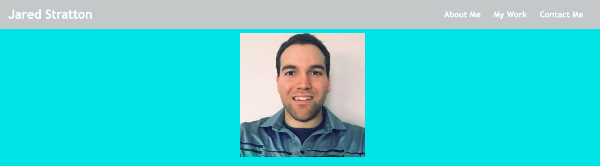
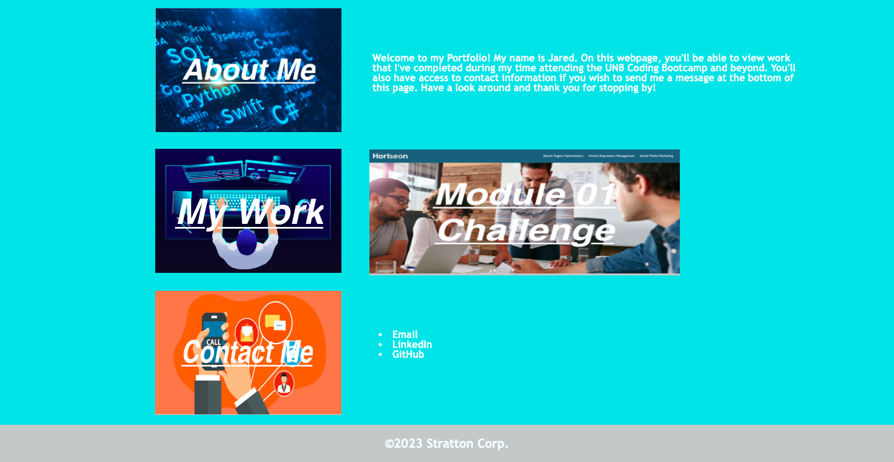

## Name
Challenge 02 for the Advanced CSS module of the Coding Bootcamp

## Description
Personal Portfolio webpage that displays three sections (About Me, My Work and Contact Information)

## Visuals

## Usage
Open your browser and visit the Direct URL that has been provided below. Once on the webpage, have a look around and see the various sections + work that is available for viewing.

Direct URL: https://elitehuskie.github.io/module-02-challenge/

## License
Using standard MIT license